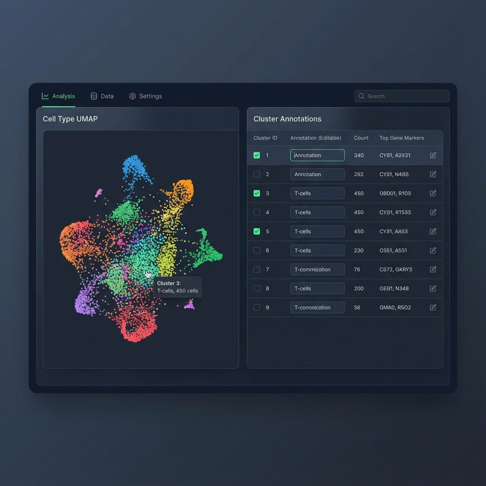

# SOWhat: Seurat Object Annotation Shiny App

[](https://www.r-project.org/)
[](https://opensource.org/licenses/MIT)

**SOWhat** is a high-performance R Shiny application designed to bridge the gap between automated single-cell analysis and manual cell type annotation. It provides an intuitive, interactive interface for exploring Seurat objects, identifying clusters, and refining annotations in real-time.



---

## 🚀 Features

### 🎨 Interactive Visualization & Renaming

- **Live UMAP Labels**: Rename clusters in the annotation table and watch the UMAP plot update instantly.
- **Feature Exploration**: Search for individual genes and visualize their expression directly on the UMAP with the **Feature Plot** tab.
- **Dynamic Cluster Seeding**: New resolutions are automatically seeded with original cluster IDs to jumpstart your work.
- **Resizable Interface**: Balance your workspace with an interactive divider between plots and metadata.

### 🧬 Advanced Analysis Suite

- **Multi-Tab Interface**: Seamlessly switch between **UMAP**, **Dot Plots**, **Module Scores**, **Clustifyr**, and **Markers**.
- **Signature Evaluation**: Calculate aggregate module scores for gene sets using `AddModuleScore`.
- **Species-Aware Presets**: Integrated gene lists (Immune, Proliferation, etc.) that automatically detect and match the case convention (Human/Mouse) of your dataset.

### 🤖 Automated Annotation (Clustifyr)

- **Reference-Based Identification**: Load reference matrices from the `refmats/` folder and compute spearman correlations.
- **One-Click Apply**: Instantly transfer top-scoring cell types to your annotation table with the "Apply Top Cell Types" button.
- **Smart Gene Matching**: Intelligent case-insensitive gene name normalization ensures compatibility across different reference platforms.

### 📋 Marker Discovery

- **FindAllMarkers Integration**: Run differential expression analysis directly from the UI.
- **Interactive Heatmaps**: Dynamically sized heatmaps that scale to fit your top markers without compression.
- **Filterable Tables**: Explore significant markers (P-adj < 0.05) in a responsive data table.

---

## 🛠️ Installation

### 1. Prerequisite

Ensure you have **R (>= 4.4.2)** installed on your system.

### 2. Clone the Repository

```bash
git clone https://github.com/MLKaufman/SOWhat
cd SOWhat
```

### 3. Setup Environment with `renv`

This project uses `renv` to ensure reproducible dependencies.

```r
# Launch R in the project directory
R

# Inside R:
install.packages("renv") # If not already installed
renv::init()             # To initialize the project
renv::restore()          # To install all required packages from renv.lock
```

### 4. Run the Application

Launch the Shiny app directly from the root directory:

```r
shiny::runApp()
```

or from the command line:

```bash
Rscript -e "shiny::runApp()"
```

---

## 📖 Usage Guide

1. **Upload Data**: Use the sidebar to upload a Seurat object (`.rds`). The app will initialize with a sample dataset if available.
2. **Select Resolution**: Choose the clustering resolution you wish to annotate.
3. **Annotate**: Type your cell type identities into the **Cluster Annotations** table.
4. **Analyze**:
    - Use **Dot Plots** or **Module Scores** to verify markers.
    - Use **Clustifyr** for algorithmic suggestions.
5. **Export**: Click **Save Annotations** to download a CSV of your work, including reasons/comments for each annotation.

---

## 📁 Project Structure

- `app.R`: Core Shiny application logic.
- `refmats/`: Directory for `.rds` reference matrices used by Clustifyr.
- `docs/images/`: Visual assets for documentation.
- `renv.lock`: Dependency lockfile.
- `genelists/`: Directory for gene lists used by the app.

---

*Built with assistance from Google Antigravity and Gemini 3 Flash*
